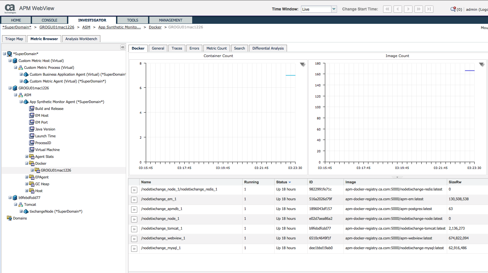
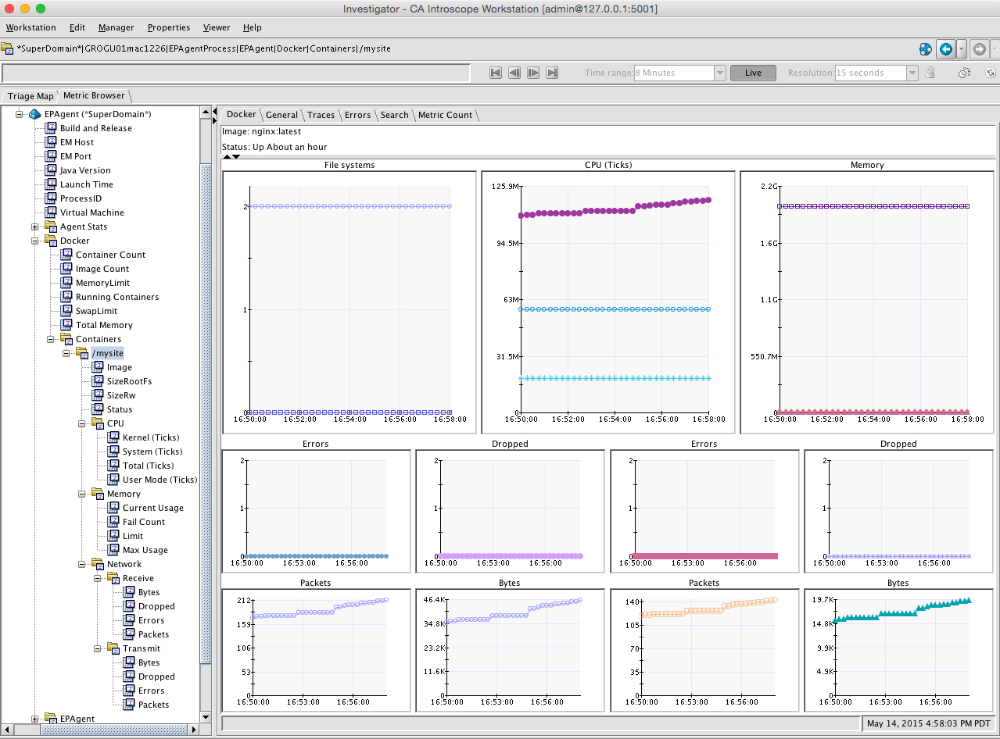

# Docker Field Pack 1.0

## Description
Docker is an open platform for developers and sysadmins to build, ship, and run distributed applications. The Docker field pack gathers metrics from the [Docker Remote API](https://docs.docker.com/reference/api/docker_remote_api/) via https.

## APM version
Restful EPAgent 9.7.1.

## Supported third party versions
Tested with Docker version 1.6.1, API version 1.18.

## Limitations
Currently the field pack only queries one docker engine and only works via https. I have tested it only with boot2docker on MacOS.
Recently I had problems with the certificate so I disabled certificate verification.

## License
[Apache License, Version 2.0, January 2004](http://www.apache.org/licenses/). See [Licensing](https://communities.ca.com/docs/DOC-231150910#license) on the CA APM Developer Community.


# Installation Instructions

## Prerequisites
* Install, configure and run an EPAgent on the same or a remote server. See [CA APM Environment Performance Agent Implementation Guide](https://wiki.ca.com/display/APMDEVOPS97/CA+APM+Environment+Performance+Agent+Implementation+Guide).

## Dependencies
Pyhton 3 with requests module. This can be obtained in one of the following ways:
      `# yum install python-requests`
                   or
      `# pip install requests`
                   or
      `# easy_install requests`

## Installation
* Extract the zip or tar.gz file.
* Copy docker.typeviewers.xml to your Enterprise Manager (MOM) <EM_HOME>/ext/xmltv.

## Configuration
Nothing else to configure.


# Usage Instructions

## Running the Docker field pack
Run `python3 docker.py` from the command line, e.g.:

`python3 docker.py -p 8080 -d boot2docker -r 2376 --certificate=$DOCKER_CERT_PATH/cert.pem -k $DOCKER_CERT_PATH/key.pem`

Change the parameters to fit your environment. Run the script with option '-h' to get this usage information:

```
Usage: docker.py [options]

Options:
    -h, --help            show this help message and exit
    -v, --verbose         verbose output
    -H HOSTNAME, --hostname=HOSTNAME
                          hostname EPAgent is running on (default: localhost)
    -p PORT, --port=PORT  http port of the EPAgent (introscope.epagent.config.httpServerPort)
    -m METRICPATH, --metric_path=METRICPATH
                          metric path prefix for all metrics
    -d DOCKERHOST, --docker_host=DOCKERHOST
                          docker hostname (default: localhost)
    -r DOCKERPORT, --docker_port=DOCKERPORT
                          docker Remote API port (default: 2376)
    -c CERTFILE, --certificate=CERTFILE
                          https certificate
    -k KEYFILE, --private_key=KEYFILE
                          https private key
```

## Metric description
Metrics are published under the metrics path "Docker". At this level general information about this docker engine is provided:
* Container Count
* Image Count
* Running Containers
* Total Memory
* MemoryLimit (boolean: 0/1)
* SwapLimit (boolean: 0/1)

Container metric for running containers are published under "Docker|Containers|<name>". Container metrics include
* Image name
* SizeRw and SizeRootFS: file system sizes
* Status
* CPU metrics (in Ticks)
* Memory metrics
* Network metrics (receive and transmit)

For more information see [Docker Remote API](https://docs.docker.com/reference/api/docker_remote_api/).

## Custom Management Modules
None.

## Custom type viewers
The type viewer docker.typeviewers.xml matches metric paths starting with "Docker". Copy it to the `ext/xmltv` folder of your APM Enterprise Manager and restart WebView or log off and back on to your Workstation. There is an overview providing general metrics and a list of containers. You can even see a Java agent monitoring the Tomcat application server running in container b9febdfcdd77:


For every container metrics about file system, CPU, memory and network metrics are shown as graphs:


## Debugging and Troubleshooting
Your can run docker.py with option -v to provide verbose output. In addition you can remove the '#' in front of several print statements throughput the script.

## Support
This document and associated tools are made available from CA Technologies as examples and provided at no charge as a courtesy to the CA APM Community at large. This resource may require modification for use in your environment. However, please note that this resource is not supported by CA Technologies, and inclusion in this site should not be construed to be an endorsement or recommendation by CA Technologies. These utilities are not covered by the CA Technologies software license agreement and there is no explicit or implied warranty from CA Technologies. They can be used and distributed freely amongst the CA APM Community, but not sold. As such, they are unsupported software, provided as is without warranty of any kind, express or implied, including but not limited to warranties of merchantability and fitness for a particular purpose. CA Technologies does not warrant that this resource will meet your requirements or that the operation of the resource will be uninterrupted or error free or that any defects will be corrected. The use of this resource implies that you understand and agree to the terms listed herein.

Although these utilities are unsupported, please let us know if you have any problems or questions by adding a comment to the CA APM Community Site area where the resource is located, so that the Author(s) may attempt to address the issue or question.

Unless explicitly stated otherwise this field pack is only supported on the same platforms as the APM core agent. See [APM Compatibility Guide](http://www.ca.com/us/support/ca-support-online/product-content/status/compatibility-matrix/application-performance-management-compatibility-guide.aspx).


# Change log
Version | Author | Comment
--------|--------|--------
1.0 | [Guenter Grossberger](mailto:Guenter.Grossberger@ca.com) | First version of the field pack.
